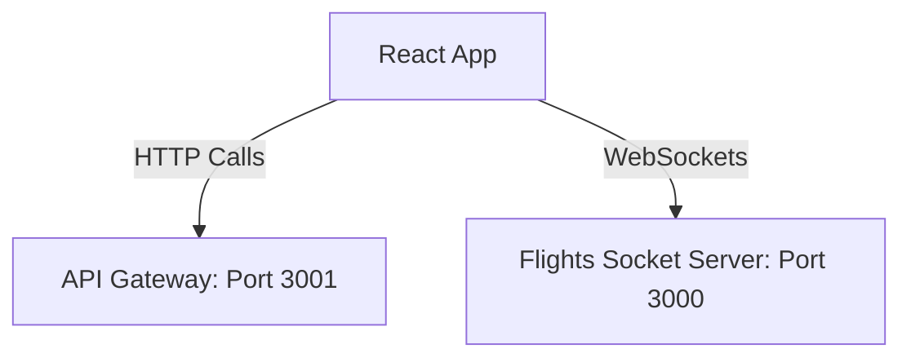
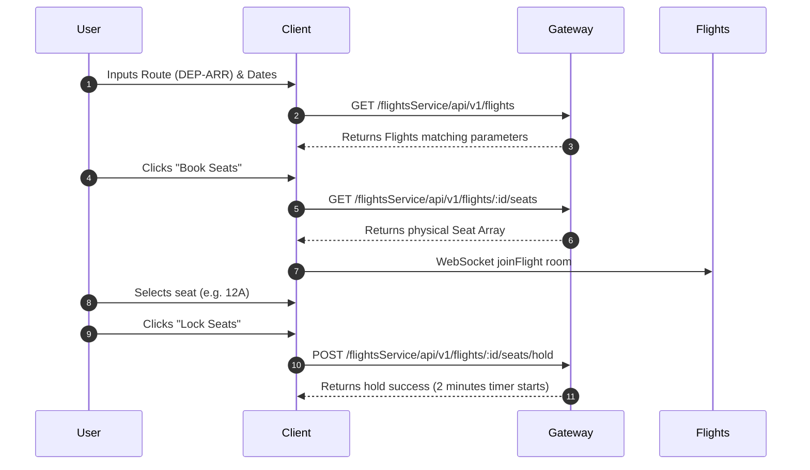

# Booking Mafia Frontend

## 1. Service Overview
The **Booking Mafia Frontend** is a production-grade single-page web client built using **React, Vite, TailwindCSS, and Redux Toolkit**. It offers users a premium, visual flight reservation wizard.

### Business Responsibilities
- **Flight Catalog Search**: Providing filtering and sorting options for active flight plans.
- **Real-time Seat Map**: Displaying seat states using Socket.IO feeds (available, held, booked).
- **Payment & Checkout Wizard**: Facilitating passenger form collection, billing invoice breakdowns, and card checkouts.
- **User dashboard**: Visualizing upcoming trips, transaction histories, and ticket downloads.

---

## 2. Folder Structure
```
frontend/
├── src/
│   ├── api/                # Axios endpoints (flightApi, seatApi, etc.)
│   ├── app/                # Redux store & root reducer setup
│   ├── components/         # Reusable UI components (Navbar, SeatMap)
│   ├── features/           # Redux slices, selectors, and async thunks
│   ├── hooks/              # Custom hooks binding components to store
│   ├── layouts/            # Page templates (MainLayout, AuthLayout)
│   ├── pages/              # View screens (Home, SeatSelection, Payment)
│   ├── routes/             # AppRoutes mapping routes
│   ├── socket/             # Socket.IO connection client
│   ├── styles/             # Tailwind global configurations
│   └── utils/              # Currency/Date formatters
```

---

## 3. Architecture Diagram


---

## 4. Sequence Diagrams

### Flight Search & Seat Selection Flow


---

## 5. API Documentation
This frontend integrates with API Gateway REST routes:
- `/api/v1/user/signup`: Registration
- `/api/v1/user/signin`: Login session
- `/api/v1/user/me`: Account details
- `/flightsService/api/v1/flights`: Flight query
- `/flightsService/api/v1/flights/:id/seats`: Physical seats layout
- `/bookingService/api/v1/bookings`: Creating booking records
- `/bookingService/api/v1/bookings/payments`: Checkout charge validation

---

## 6. State Schema (Redux Store)
- **`auth`**: `user`, `token`, `isAuthenticated`, `loading`, `error`
- **`flights`**: `flights`, `selectedFlight`, `filters`, `sort`, `loading`
- **`seats`**: `seats`, `selectedSeatNumbers`, `holdDetails`, `timerSeconds`
- **`booking`**: `currentBooking`, `userBookings`, `idempotencyKey`, `paymentSuccess`

---

## 7. Service Communication
- **Axios client**: Handles authorization tokens inside interceptors.
- **Socket.IO client**: Hooks WebSocket connection when opening `/flights/:id/seats`.

---

## 8. Docker Documentation
- **Build Command**:
  ```bash
  docker build -t bookingmafia/frontend:latest .
  ```
- **Ports**: Exposes port `5173` (Vite dev) or `80` (Nginx static bundle).

---

## 9. Kubernetes Documentation
- Exposes statically compiled static assets via Nginx ingress mapping.

---

## 10. Environment Variables
See `.env.example`:
```ini
VITE_API_GATEWAY_URL=http://localhost:3001
VITE_FLIGHTS_SOCKET_URL=http://localhost:3000
```

---

## 11. Error Handling Strategy
- Standardizes interceptor exceptions to show error cards on form validation failures.

---

## 12. Logging Strategy
- Utilizes browser console log channels for state and debug tracing.

---

## 13. Scaling Strategy
- Compiled into a static HTML/JS folder (`dist`), allowing static file serving via Nginx or CDN (S3, Cloudflare).

---

## 14. Security
- Restricts pages using a wrapper `ProtectedRoute`. Passes JWT bearer tokens on all authenticated requests.

---

## 15. Future Improvements
- **Offline States**: Cache searches locally.
- **Boarding Pass PDF**: Generate canvas passes.
